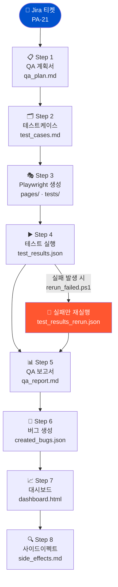

# jira-qa-pipeline

Jira QA 요청 티켓 하나로 **QA 계획서 → 테스트케이스 → Playwright 자동화 → 실행 → 보고서 → 버그 생성 → 대시보드 → 사이드이펙트 감지**까지 8단계를 자동으로 처리하는 파이프라인입니다.

Claude Code가 문서·POM·테스트 생성에 참여하고, acli(Atlassian CLI)로 Jira와 연동합니다.

---

## 파이프라인 흐름



> **Claude Code** 가 Step 1·2·3에서 페이지 분석·문서·테스트 코드를 생성하고, Step 4·5·6·7은 스크립트가 자동 처리합니다.

---

## 주요 기능

| 단계 | 내용 |
|------|------|
| Step 1: QA 계획서 | Jira 티켓 정보를 fetch하여 13섹션 QA 계획서 생성 |
| Step 2: 테스트케이스 | QA 계획서 기반 테스트케이스 작성 |
| Step 3: Playwright 생성 | playwright-cli로 페이지 분석 후 POM + 테스트 코드 생성 (증거 스크린샷은 필요한 TC에서만 선택 캡처) |
| Step 4: 테스트 실행 | Playwright 자동 실행 + 결과 JSON 저장 + 실패 스크린샷(only-on-failure) + 실패 목록/재실행 스크립트 생성 |
| Step 5: QA 보고서 | 실패 요약(테스트케이스 ID 포함) + 1차 실패 원인 분석 + 실패만 1회 재테스트 결과 히스토리까지 자동 생성 |
| Step 6: 버그 생성 | 실패 테스트를 Jira 버그 티켓으로 자동 등록 |
| Step 7: 대시보드 | Jira 버그 데이터를 집계한 HTML 대시보드 생성 |
| Step 8: 사이드이펙트 | 최근 버그 분석으로 사이드이펙트 감지 및 리포트 |

---

## 요구 사항

- Python 3.13+
- Node.js (npx, playwright)
- [acli](https://acliforjira.com/) — Atlassian CLI (Jira 연동)
- Jira 계정 및 접근 권한

---

## 빠른 시작

### 1. 설치

```bash
git clone https://github.com/jhseo808/jira-qa-pipeline.git
cd jira-qa-pipeline

python -m venv .venv
.venv\Scripts\activate        # Windows
# source .venv/bin/activate   # macOS/Linux

pip install -r requirements.txt
```

### 2. 초기 설정

```bash
# .env, config.local.yaml 템플릿 생성
python workflow_runner.py --init
```

생성된 `config.local.yaml`에 acli 경로와 Jira 정보를 입력합니다:

```yaml
acli:
  path: "C:/path/to/acli.exe"
  token_path: "C:/path/to/token.txt"
  site: "https://your-domain.atlassian.net"
  email: "your@email.com"
```

### 3. 환경 점검

```bash
python workflow_runner.py --doctor
```

### 4. 파이프라인 실행

```bash
# 전체 8단계 실행
python workflow_runner.py --ticket PA-21 --step all --url https://your-target-url.com

# 특정 단계만 실행
python workflow_runner.py --ticket PA-21 --step plan

# 특정 단계부터 재시작
python workflow_runner.py --ticket PA-21 --step all --from-step report
```

### (옵션) 실행이 느릴 때

- 기본 설정은 `config.yaml`의 `playwright.workers=2`, `playwright.fully_parallel=true` 로 병렬 실행한다.
- 실패가 나면 Step 4가 아래 파일을 자동 생성하고, **실패 케이스만 1회 재실행**할 수 있다.
  - `output/{ticket}/failed_tests.txt`
  - `output/{ticket}/rerun_failed.ps1` → `output/{ticket}/test_results_rerun.json`

---

## 설정

| 파일 | 용도 |
|------|------|
| `config.yaml` | 공유 가능한 기본 설정 (상대경로, 무해한 값) |
| `config.local.yaml` | 로컬 전용 설정 (acli 경로, 토큰 등) — gitignore |
| `.env` | 환경변수 오버라이드 — gitignore |
| `config.sample.yaml` | 설정 예시 |

**주요 환경변수:**

```bash
QA_PIPELINE_CONFIG=./config.local.yaml
QA_PIPELINE_ACLI_PATH=C:\path\to\acli.exe
QA_PIPELINE_OUTPUT_DIR=./output
QA_PIPELINE_PW_WORKERS=2
QA_PIPELINE_PW_FULLY_PARALLEL=1
QA_PIPELINE_PW_MAX_FAILURES=1
QA_PIPELINE_REPORT_DATE=YYYY-MM-DD
```

---

## 프로젝트 구조

```
jira-qa-pipeline/
├── workflow_runner.py          # 메인 오케스트레이터
├── generate_dashboard.py       # HTML 대시보드 생성
├── config.yaml                 # 기본 설정
├── lib/                        # 공통 라이브러리
│   ├── acli.py                 # Jira CLI 래퍼 (AcliClient)
│   ├── config.py               # 설정 로더
│   ├── state.py                # 파이프라인 상태 관리
│   ├── doctor.py               # 환경 진단
│   ├── scheduler.py            # Windows Task Scheduler 연동
│   └── ...
├── steps/                      # 단계별 모듈 (step1~8)
├── tests/                      # 단위 테스트
├── templates/                  # QA 문서 마스터 템플릿
├── docs/claude/                # Claude Code 가이드 문서
└── output/{ticket}/            # 파이프라인 산출물 (gitignore)
    ├── qa_plan.md
    ├── test_cases.md
    ├── playwright/
    ├── test_results.json
    ├── qa_report.md
    ├── created_bugs.json
    ├── dashboard.html
    └── side_effects.md
```

---

## CLI 옵션

```bash
python workflow_runner.py [OPTIONS]

  --ticket       Jira 티켓 키 (예: PA-21)
  --step         실행할 단계 (all / plan / testcases / playwright /
                              run / report / bugs / dashboard / sideeffects)
  --url          Playwright 대상 URL
  --from-step    특정 단계부터 재시작
  --daily        모든 활성 티켓의 dashboard + sideeffects 실행
  --schedule     Windows Task Scheduler에 일별 실행 등록
  --dry-run      실행 계획만 출력 (실제 실행 없음)
  --doctor       환경 점검
  --validate-config  설정 검증
  --init         로컬 설정 템플릿 생성
```

---

## 테스트

```bash
pytest tests/ -v
```

---

## CI / CD

- **CI**: push 및 PR 시 `pytest` + `ruff` 자동 실행 (`.github/workflows/ci.yml`)
- **Release**: `v*.*.*` 태그 push 시 품질 게이트 → 빌드 → GitHub Release 자동 생성

```bash
# 버전 bump 및 릴리즈
python scripts/bump_version.py --new-version 0.1.1
git add pyproject.toml CHANGELOG.md
git commit -m "chore: bump version to 0.1.1"
git tag v0.1.1
git push origin main --tags
```

---

## 주의 사항

- 예시에 사용된 URL(Melon 차트 등)은 **데모·학습용 샘플**입니다. 본 저장소와 해당 서비스 운영사는 무관하며, 실제 운영 환경에서는 호출 빈도와 환경(STG 등)을 각자 정책에 맞게 조정하세요.
- `config.local.yaml`, `.env`, `output/` 디렉터리는 `.gitignore`에 등록되어 있어 커밋되지 않습니다.
